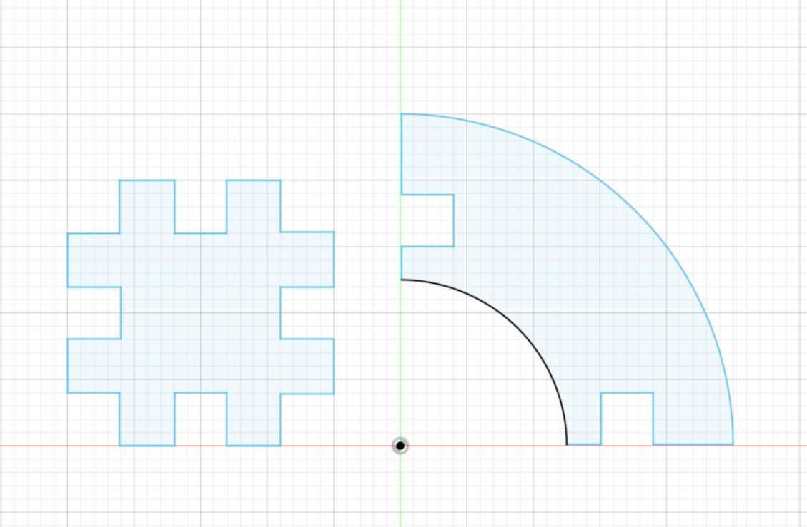
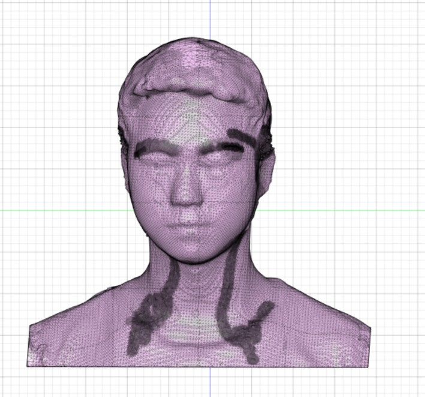

# Introduction

## About this repo
This repo keeps all materials and product of fablab-20spring.

## About me
My name is Hongze Shen, a Completely Silly boy majoring in Computer Science.

## About this file
A brif document for the course.

# Assignment
All source files are arranged in the folder named 'assignments', please check them if needed.

## Week 1: Laser cutting

**Goal**: Using Fusion360 to design the patterns, cut the board using laser cutting and assemble them.

**Show**: 

1. Design
  

2. Basic component
  

3. Output
   

## Week 2: 3D priting

**Goal**: Design an object that can not be laser-cutted.

**Analysis**: Mathematically speaking, a non-laser-cutted object  can not be projected onto a plane without information losses. Selecting a 3D curve arbitrarily you can always get such a curve. I prefer **Double Helix**, an elegant curve which presents the structure of DNA.

And the parameters are well tuned such that at every point on the curve, the slope is exactly 60 degree which means that the curve doesn't need any support.

> A brief proof: The diameter is 40mm, thus the height of curve should be $40*pi*\sqrt{3}/2=108.82$mm, so I set the height as 110mm.

**Show**:
1. Design:
  

2. Output
  

## Week 3: Arduino

**Goal**: Interact with a LCD screen using a joy stick made of 4 buttons.

**Show**:

1. Design

(1) Joystick

(2) LCD screen

2. Output

The LCD screen will tell a story line by line when you press th right button. Please see the project show video for more details.

## week 4: Machine

**Goal**: Assemble the backbone of printer and make it move.

**Show**:

 

## week 5: 3D scanning

**Goal**: Scan your head, adapt it and print.

**Show**:

I open a tube in my head and add some blood. A bullet went through this guy's head but he kept calm.

 

